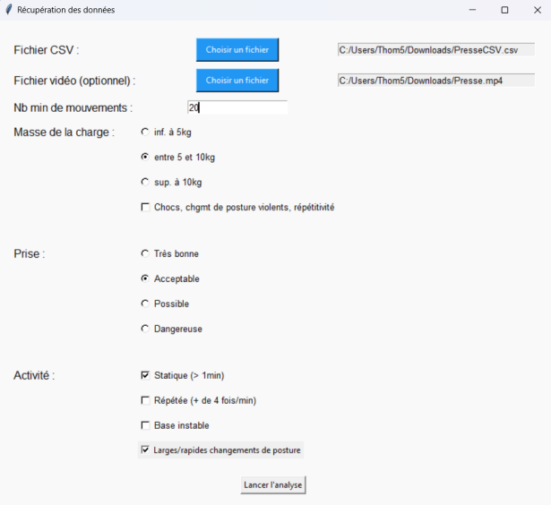
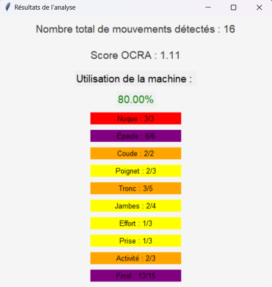

# 🏭 Operator-Machine Interaction Analysis

## 📖 Project Overview
This project aligns with Industry 5.0 by analyzing operator movements to identify ergonomic risks (musculoskeletal disorders - MSDs) and evaluate impacts on machine durability. Using video observation and manual movement analysis, the goal is to enhance worker safety and improve the sustainability of industrial equipment.

---

## 🛠️ Methodology and Implementation

### 📹 Video Analysis with Kinovea
- **Video Preparation**: Imported a video showing an operator working with a machine into Kinovea for frame-by-frame analysis.
- **Manual Marking of Key Points**:
  - Three points were placed on each studied joint (wrist, elbow, shoulder, and neck).
  - These points were manually repositioned for each frame to capture angular variations of the joints throughout the video.
- **Data Collection**: Exported the point coordinates from Kinovea, providing raw data for angle calculations and movement analysis.

### 📊 Calculating REBA and OCRA Scores
#### **REBA (Rapid Entire Body Assessment)**
- Joint angles were used to assign a REBA score, assessing overall ergonomic risk.
- The calculation considered posture, the load handled, and movement frequency.
- Default values were used for unmeasured joints to generate a global score.

#### **OCRA (Occupational Repetitive Actions)**
- Analyzed the repetitiveness and intensity of technical gestures.
- Repetitive movements of the arms and shoulders were evaluated to calculate an OCRA score, indicating the risk level for MSDs.

### ⚙️ Machine Impact Evaluation
- Compared the total number of technical actions performed by the operator to the minimum required to complete the task.
- Identified excessive gestures as factors contributing to premature machine degradation.

### 💻 Interface Development
- **Displayed Results**:
  - Total number of movements.
  - REBA and OCRA scores for analyzed joints.
  - Assessment of the impact of technical gestures on equipment durability.

---

## 🎨 Communication and Visualization
### Poster Creation
A poster was designed to visually and concisely present the project's objectives and results. This was part of the communication course, aimed at improving visual presentation and technical communication skills.

### 📋 Poster Features:
- Clear and attractive design.
- Highlights of the analysis process and key findings.
- Targeted towards both technical and non-technical audiences.

---

## 📷 Resources
### Screenshots:
Below are key visuals from the project:

#### 1️⃣ Poster

#### 2️⃣ Interface

#### 3️⃣ Result

---

### 🎥 Video Demonstration
Click the link below to access the video demonstration of the analysis process using **Kinovea**:

[➡️ Watch the Video](https://said2404.github.io/Operator-Machine-Interaction/)

---

### ✍️ Authors
This project was carried out as part of a university project, in collaboration with my team. 